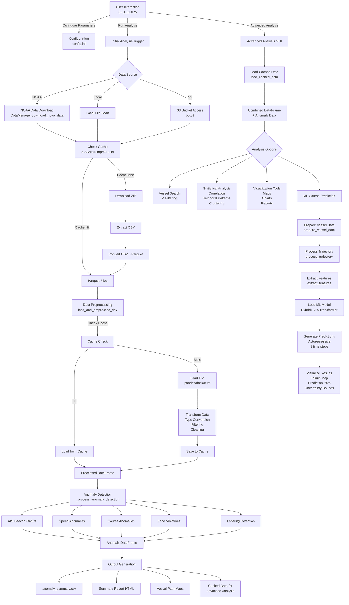
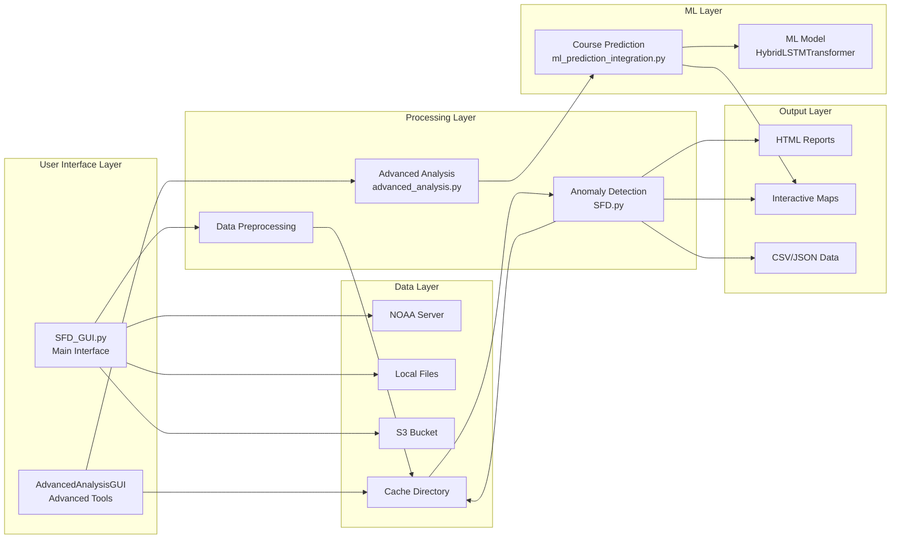

# AIS Shipping Fraud Detection (SFD) System

**Version 2.1 Beta**  
**Team Dreadnaught**: Alex Giacomello, Christopher Matherne, Rupert Rigg, Zachary Zhao

---

## Table of Contents

1. [Overview](#overview)
2. [Features](#features)
3. [System Requirements](#system-requirements)
4. [Installation](#installation)
5. [Quick Start Guide](#quick-start-guide)
6. [Detailed Usage](#detailed-usage)
7. [Data Flow Architecture](#data-flow-architecture)
8. [Configuration](#configuration)
9. [Output Files](#output-files)
10. [Troubleshooting](#troubleshooting)
11. [Advanced Topics](#advanced-topics)

---

## Overview

The AIS Shipping Fraud Detection (SFD) System is a comprehensive analysis platform designed to detect anomalous vessel behavior patterns in Automatic Identification System (AIS) data. The system combines traditional anomaly detection algorithms with advanced machine learning capabilities to identify potential fraud, suspicious activities, and compliance violations in maritime traffic.

### Three Major Components

1. **Initial Analysis** - Automated anomaly detection on AIS data
2. **Advanced Analysis** - Interactive tools for deep-dive investigations
3. **ML Course Prediction** - Machine learning-powered vessel trajectory forecasting

### What It Does

- **Detects Anomalies**: Identifies suspicious vessel behaviors including:
  - AIS beacon manipulation (sudden on/off)
  - Impossible speed/distance jumps
  - Course inconsistencies
  - Restricted zone violations
  - Loitering patterns

- **Analyzes Patterns**: Provides statistical analysis tools for:
  - Correlation analysis between vessel types and anomalies
  - Temporal pattern detection
  - Vessel behavior clustering

- **Predicts Trajectories**: Uses deep learning to forecast vessel positions up to 48 hours ahead with uncertainty quantification

---

## Features

### Core Capabilities

- ✅ **Multiple Data Sources**: NOAA AIS data, local files, or AWS S3 buckets
- ✅ **Automated Processing**: Batch processing of date ranges
- ✅ **Intelligent Caching**: Reduces processing time on subsequent runs
- ✅ **GPU Acceleration**: Optional NVIDIA CUDA or AMD ROCm support
- ✅ **Interactive Visualizations**: HTML maps, charts, and reports
- ✅ **Machine Learning Integration**: Deep learning course prediction
- ✅ **Comprehensive Reporting**: HTML summaries, CSV exports, interactive maps

### Anomaly Detection Types

- **AIS Beacon On/Off**: Detects vessels that suddenly appear or disappear
- **Speed Anomalies**: Identifies impossible position jumps
- **Course Anomalies**: Flags inconsistent heading/course changes
- **Zone Violations**: Monitors entry into restricted areas
- **Loitering Detection**: Identifies vessels with minimal movement

### Advanced Analysis Tools

- Vessel search and filtering
- Statistical correlation analysis
- Temporal pattern analysis
- Vessel behavior clustering (K-Means)
- Interactive map visualizations
- Excel report generation

### Machine Learning Features

- Hybrid LSTM-Transformer architecture
- 48-hour trajectory prediction
- Uncertainty quantification
- Autoregressive prediction
- Interactive prediction visualization

---

## System Requirements

### Minimum Requirements

- **Operating System**: Windows 10/11, Linux (Ubuntu 18.04+), or macOS 10.14+
- **Python**: 3.8 or higher (3.9+ recommended)
- **RAM**: 8 GB minimum (16 GB recommended for large datasets)
- **Storage**: 10 GB free space (more for large date ranges)
- **Internet**: Required for NOAA data downloads

### Recommended Requirements

- **CPU**: Multi-core processor (4+ cores)
- **RAM**: 16 GB or more
- **GPU**: Optional but recommended for ML predictions
  - NVIDIA GPU with CUDA support, or
  - AMD GPU with ROCm support
- **Storage**: SSD with 50+ GB free space

### Python Version

The system supports Python 3.8 through 3.14. Python 3.9 or higher is recommended for best performance.

---

## Installation

### Step 1: Install Python

If Python is not already installed:

- **Windows**: Download from [python.org](https://www.python.org/downloads/)
- **Linux**: `sudo apt-get install python3 python3-pip` (Ubuntu/Debian)
- **macOS**: `brew install python3` or download from python.org

Verify installation:
```bash
python --version
# Should show Python 3.8 or higher
```

### Step 2: Install System Dependencies

#### Windows
- tkinter is usually included with Python
- No additional system packages required

#### Linux
```bash
# Install tkinter (required for GUI)
sudo apt-get install python3-tk

# For Ubuntu/Debian
sudo apt-get install build-essential
```

#### macOS
- tkinter is included with Python from python.org
- If using Homebrew Python, may need: `brew install python-tk`

### Step 3: Clone or Download the Project

```bash
# If using git
git clone <repository-url>
cd SFD_Beta_release-main

# Or download and extract the ZIP file
```

### Step 4: Install Python Dependencies

Navigate to the project directory and install requirements:

```bash
cd SFD_Beta_release-main
pip install -r requirements.txt
```

**Note**: This may take 10-20 minutes depending on your internet connection.

#### GPU Support (Optional)

**For NVIDIA GPUs:**
```bash
# Uninstall CPU-only PyTorch first
pip uninstall torch torchvision torchaudio

# Install CUDA-enabled PyTorch
pip install torch torchvision torchaudio --index-url https://download.pytorch.org/whl/cu118
```

**For AMD GPUs:**
```bash
# Install PyTorch with ROCm support
# See: https://pytorch.org/get-started/locally/
# Note: ROCm on Windows is experimental - Linux recommended
```

### Step 5: Verify Installation

Run a quick test to ensure everything is installed:

```bash
python -c "import pandas, numpy, torch, folium; print('All dependencies installed!')"
```

If you see "All dependencies installed!", you're ready to go!

---

## Quick Start Guide

### Launching the Application

#### Option 1: GUI (Recommended for Beginners)

```bash
python SFD_GUI.py
```

This opens the graphical user interface.

#### Option 2: Command Line

```bash
python SFD.py --start-date 2024-10-01 --end-date 2024-10-03 --data-source noaa --output-directory ./output
```

### Your First Analysis (5 Steps)

1. **Launch the GUI**
   ```bash
   python SFD_GUI.py
   ```

2. **Configure Data Source**
   - Go to the "Data" tab
   - Select "NOAA" as data source
   - Enter year (e.g., "2024")

3. **Set Date Range**
   - Select start date (e.g., 2024-10-01)
   - Select end date (e.g., 2024-10-03)
   - Note: Start with 2-3 days for your first run

4. **Choose Output Directory**
   - Click "Browse" next to "Output Directory"
   - Select or create a folder for results

5. **Run Analysis**
   - Click "Run Analysis" button
   - Wait for processing to complete
   - Results will be in your output directory

### Viewing Results

After analysis completes:

1. Navigate to your output directory
2. Open `Summary_Report_*.html` in a web browser
3. Review detected anomalies and statistics
4. Click "Advanced Analysis" button in GUI for deeper investigation

---

## Detailed Usage

### Part 1: Initial Analysis

The initial analysis performs automated anomaly detection on AIS data.

#### Using the GUI

1. **Data Tab Configuration**
   - **Data Source**: Choose from:
     - `NOAA`: Download from NOAA servers (requires internet)
     - `Local`: Use files on your computer
     - `S3`: Access AWS S3 bucket (requires credentials)
   
   - **Date Range**: 
     - Start Date: First day to analyze
     - End Date: Last day to analyze
     - Recommended: Start with 2-3 days for testing

   - **Output Directory**: Where results will be saved

2. **Filters Tab**
   - **Vessel Types**: Select specific vessel types to analyze
     - Type 30: Fishing vessels
     - Type 70: Cargo vessels
     - Type 80: Tanker vessels
     - (See full list in GUI)
   
   - **Anomaly Types**: Enable/disable specific anomaly detectors
     - AIS Beacon On/Off
     - Speed Anomalies
     - Course Anomalies
     - Zone Violations
     - Loitering

3. **Zones Tab** (Optional)
   - Define restricted zones
   - Set latitude/longitude boundaries
   - Enable zone violation detection

4. **Run Analysis**
   - Click "Run Analysis" button
   - Progress window shows:
     - Data download progress (if using NOAA)
     - Processing status
     - Estimated completion time
   - Analysis may take 10-60 minutes depending on data size

#### Using Command Line

```bash
python SFD.py \
  --start-date 2024-10-01 \
  --end-date 2024-10-03 \
  --data-source noaa \
  --output-directory ./output \
  --debug
```

**Command Line Arguments:**
- `--start-date`: Start date (YYYY-MM-DD)
- `--end-date`: End date (YYYY-MM-DD)
- `--data-source`: `noaa`, `local`, or `s3`
- `--data-directory`: Path to local files (if using local source)
- `--output-directory`: Where to save results
- `--debug`: Enable debug logging

#### What Happens During Initial Analysis

1. **Data Acquisition**
   - Downloads or loads AIS data files
   - Checks cache for previously processed data
   - Converts CSV to Parquet format (if needed)

2. **Data Preprocessing**
   - Loads and validates data
   - Filters by vessel type (if specified)
   - Cleans invalid coordinates
   - Removes unrealistic speeds
   - Saves processed data to cache

3. **Anomaly Detection**
   - Compares consecutive days of data
   - Detects beacon on/off events
   - Calculates speed anomalies
   - Identifies course inconsistencies
   - Checks zone violations
   - Detects loitering patterns

4. **Output Generation**
   - Creates anomaly summary CSV
   - Generates HTML report
   - Creates vessel path maps
   - Saves statistics

### Part 2: Advanced Analysis

Advanced Analysis provides interactive tools for investigating detected anomalies and exploring data patterns.

#### Accessing Advanced Analysis

1. **After Initial Analysis**
   - Click "Advanced Analysis" button in main GUI
   - Or run: `python advanced_analysis.py`

2. **Select Analysis Run**
   - GUI shows list of previous analysis runs
   - Select the run you want to investigate
   - Click "Load" to load cached data

#### Available Tools

##### 1. Vessel Search & Filtering

**Purpose**: Find specific vessels or filter by criteria

**How to Use**:
1. Click "Vessel Search" in Advanced Analysis GUI
2. Enter search criteria:
   - MMSI number
   - Vessel name (if available)
   - Vessel type
   - Date range
3. Click "Search"
4. Results show:
   - Vessel information
   - Anomaly history
   - Trajectory data

**Use Cases**:
- Investigate a specific vessel
- Find all vessels of a certain type
- Filter anomalies by date range

##### 2. Statistical Analysis

**Correlation Analysis**:
- Analyzes relationships between vessel types and anomaly types
- Generates correlation matrices
- Helps identify patterns (e.g., "Type 70 vessels often show speed anomalies")

**How to Use**:
1. Click "Correlation Analysis"
2. Select up to 2 vessel types
3. Select up to 2 anomaly types
4. Click "Run Analysis"
5. Review correlation results

**Temporal Pattern Analysis**:
- Identifies time-based patterns in anomalies
- Shows when anomalies are most common
- Helps identify systematic issues

**How to Use**:
1. Click "Temporal Pattern Analysis"
2. Wait for analysis to complete
3. Review temporal charts and statistics

**Vessel Behavior Clustering**:
- Groups vessels by behavior patterns
- Uses K-Means clustering algorithm
- Helps identify vessel groups with similar behaviors

**How to Use**:
1. Click "Vessel Behavior Clustering"
2. Select vessel types to analyze
3. Specify number of clusters (default: 5)
4. Click "Run Analysis"
5. Review cluster assignments and visualizations

##### 3. Visualization Tools

**Interactive Maps**:
- Folium-based interactive maps
- Shows vessel trajectories
- Highlights anomaly locations
- Heat maps for anomaly density

**Statistical Charts**:
- Time series plots
- Distribution charts
- Correlation heatmaps
- Generated using Matplotlib/Plotly

**Excel Reports**:
- Comprehensive data tables
- Embedded charts
- Exportable for further analysis

##### 4. ML Course Prediction

**Purpose**: Predict future vessel positions using machine learning

**Prerequisites**:
- Trained ML model (`best_model.pt` in `ml_course_prediction/models/trained/`)
- Vessel with sufficient historical data (≥24 hours, ≥2 data points)

**How to Use**:
1. In Advanced Analysis, search for a vessel
2. Select a vessel from results
3. Click "Predict Course" button
4. System will:
   - Load vessel trajectory data
   - Prepare features
   - Load ML model
   - Generate 48-hour prediction (8 time steps)
   - Display interactive map with:
     - Historical trajectory (blue line)
     - Predicted path (green line)
     - Uncertainty bounds (shaded area)

**Understanding Predictions**:
- **Prediction Horizon**: 48 hours ahead
- **Time Steps**: 8 steps at 6-hour intervals
- **Uncertainty**: Shows 68% confidence bounds
- **Accuracy**: Improves with more historical data

**Model Requirements**:
- Model file: `ml_course_prediction/models/trained/best_model.pt`
- If model not found, you'll need to train one first (see Advanced Topics)

### Part 3: Machine Learning Integration

The ML Course Prediction system uses a hybrid LSTM-Transformer architecture to predict vessel trajectories.

#### How ML Prediction Works

1. **Data Preparation**
   - Extracts vessel trajectory from cached data
   - Filters to last 24 hours of data
   - Validates minimum data requirements (≥2 points, ≥1 hour span)

2. **Trajectory Processing**
   - Segments trajectory (splits on gaps >6 hours)
   - Selects most recent valid segment
   - Ensures minimum requirements met

3. **Feature Engineering**
   - Extracts features:
     - Position (LAT, LON)
     - Speed (SOG)
     - Course (COG)
     - Heading
     - Temporal features
     - Vessel features
   - Creates sequence of 24 time steps
   - Converts to tensor format

4. **Model Inference**
   - Loads trained HybridLSTMTransformer model
   - Performs autoregressive prediction:
     - Predicts next time step
     - Uses prediction as input for next step
     - Repeats for 8 time steps (48 hours)
   - Generates uncertainty estimates

5. **Visualization**
   - Creates interactive Folium map
   - Displays historical and predicted paths
   - Shows uncertainty bounds
   - Opens in web browser

#### ML Model Architecture

- **LSTM Encoder**: Processes sequential patterns
  - Bidirectional LSTM
  - Hidden size: 128
  - 2 layers with dropout (0.2)

- **Transformer Encoder**: Captures long-range dependencies
  - Multi-head attention (8 heads)
  - Hidden size: 256
  - 4 layers with dropout (0.1)

- **Fusion Layer**: Combines LSTM and Transformer outputs
  - Hidden size: 256

- **Uncertainty Head**: Quantifies prediction uncertainty
  - Variational inference
  - Provides confidence bounds

#### Training Your Own Model

See [Advanced Topics](#advanced-topics) section for model training instructions.

---

## Data Flow Architecture

### High-Level Overview

The SFD system processes data through several stages:

```
User Input → Data Acquisition → Transformation → Analysis → Output
```

### Detailed Data Flow

#### Stage 1: User Interaction

**Entry Point**: `SFD_GUI.py`

- User configures analysis parameters
- Selects data source (NOAA/Local/S3)
- Sets date range and filters
- Initiates analysis

**Configuration Saved**: `config.ini`

#### Stage 2: Data Acquisition

**NOAA Data Source**:
```
User Input (Date Range)
    ↓
DataManager.download_noaa_data()
    ↓
For each date:
    ├─ Check cache (AISDataTemp/parquet/)
    ├─ If cached: Use existing file
    └─ If not cached:
        ├─ Download ZIP from NOAA
        ├─ Extract CSV files
        ├─ Convert CSV → Parquet
        └─ Save to cache
    ↓
Return list of parquet file paths
```

**Local File Source**:
```
User Input (Data Directory)
    ↓
Scan directory for CSV/Parquet files
    ↓
Filter by date range
    ↓
Return list of file paths
```

**S3 Data Source**:
```
User Input (S3 Bucket, Credentials)
    ↓
boto3 S3 Client
    ↓
List and download objects
    ↓
Filter by date range
    ↓
Return list of file paths
```

#### Stage 3: Data Transformation

```
File Path (CSV/Parquet)
    ↓
load_and_preprocess_day() [SFD.py]
    ↓
[Check Cache]
    ├─ If cached: Load from cache
    └─ If not cached: Continue
    ↓
[Load File]
    ├─ GPU Mode (NVIDIA): cudf
    ├─ Dask Mode: dd.read_* → compute()
    └─ Pandas Mode: pd.read_*
    ↓
[Data Type Conversion]
    ├─ BaseDateTime → datetime
    ├─ MMSI → float64
    ├─ LAT, LON, SOG, COG → numeric
    ↓
[Vessel Type Filtering]
    ├─ Filter by SELECTED_SHIP_TYPES
    └─ Handle 2-digit vs 3-digit types
    ↓
[Data Cleaning]
    ├─ Remove missing LAT/LON
    ├─ Remove invalid coordinates
    ├─ Remove unrealistic speeds
    └─ Remove duplicates
    ↓
[Save to Cache]
    └─ Save as .parquet file
    ↓
Return Preprocessed DataFrame
```

#### Stage 4: Initial Analysis

```
Preprocessed DataFrames (per day)
    ↓
_process_anomaly_detection() [SFD.py]
    ↓
[Day-by-Day Processing]
    For each day (starting from day 2):
        ├─ Load current day data
        ├─ Load previous day data
        └─ Compare for anomalies
    ↓
[Anomaly Detection Modules]
    ├─ AIS Beacon On/Off Detection
    ├─ Speed Anomalies (Position Jumps)
    ├─ Course Anomalies
    ├─ Zone Violations
    └─ Loitering Detection
    ↓
[Anomaly Aggregation]
    ├─ Combine all anomaly types
    ├─ Add metadata
    └─ Create anomaly DataFrame
    ↓
[Output Generation]
    ├─ Save anomaly summary (CSV)
    ├─ Generate HTML report
    ├─ Create vessel path maps
    └─ Save statistics
```

#### Stage 5: Advanced Analysis

```
AdvancedAnalysisGUI
    ↓
[Load Cached Data]
    ├─ Find cache files for date range
    ├─ Load parquet files
    ├─ Load anomaly summary
    └─ Combine into DataFrame
    ↓
[Analysis Options]
    ├─ Vessel Search & Filtering
    ├─ Statistical Analysis
    ├─ Visualization Tools
    └─ ML Course Prediction
```

#### Stage 6: ML Course Prediction

```
Vessel Selection
    ↓
[Prepare Vessel Data]
    ├─ Filter by MMSI
    ├─ Get last 24 hours
    └─ Validate data
    ↓
[Process Trajectory]
    ├─ Segment trajectories
    ├─ Filter valid segments
    └─ Select most recent
    ↓
[Extract Features]
    ├─ Create sequence features
    ├─ Extract: LAT, LON, SOG, COG, etc.
    └─ Convert to tensor [1, 24, N]
    ↓
[Load ML Model]
    ├─ Load config (YAML)
    ├─ Initialize HybridLSTMTransformer
    ├─ Load weights
    └─ Set to eval mode
    ↓
[Generate Predictions]
    For 8 time steps (48 hours):
        ├─ Model forward pass
        ├─ Extract prediction + uncertainty
        └─ Append to input sequence
    ↓
[Visualize Results]
    ├─ Create Folium map
    ├─ Plot historical trajectory
    ├─ Plot predicted path
    └─ Add uncertainty bounds
```

### Visual Data Flow Diagram



### System Architecture Diagram



### How Components Work Together

1. **Data Acquisition → Transformation**
   - Raw AIS data (CSV/Parquet) is downloaded or loaded
   - Data is preprocessed and cached
   - Cache enables fast subsequent analysis

2. **Transformation → Initial Analysis**
   - Preprocessed data feeds into anomaly detection
   - Day-by-day comparisons identify anomalies
   - Results are saved for advanced analysis

3. **Initial Analysis → Advanced Analysis**
   - Cached data and anomaly results are loaded
   - Interactive tools enable deep investigation
   - Statistical analysis reveals patterns

4. **Advanced Analysis → ML Prediction**
   - Vessel data is extracted from cache
   - Features are engineered for ML model
   - Predictions are generated and visualized

5. **Output Generation**
   - All stages produce outputs (CSV, HTML, maps)
   - Outputs are saved to specified directory
   - Results can be shared or further analyzed

---

## Configuration

### Configuration File: `config.ini`

The system uses `config.ini` for all settings. The GUI automatically saves your settings, but you can also edit the file directly.

### Key Configuration Sections

#### `[DATA]` Section
```ini
data_directory = /path/to/data
output_directory = /path/to/output
start_date = 2024-10-01
end_date = 2024-10-03
```

#### `[SHIP_FILTERS]` Section
```ini
selected_ship_types = 30,70,80
```
- Comma-separated list of vessel type codes
- Type 30: Fishing
- Type 70: Cargo
- Type 80: Tanker
- (See full list in GUI)

#### `[ANOMALY_THRESHOLDS]` Section
```ini
min_travel_nm = 200.0
max_travel_nm = 550.0
cog_heading_max_diff = 45.0
min_speed_for_cog_check = 15.0
beacon_time_threshold_hours = 6.0
```

#### `[ANOMALY_TYPES]` Section
```ini
ais_beacon_off = True
ais_beacon_on = True
excessive_travel_distance_fast = True
excessive_travel_distance_slow = True
cog-heading_inconsistency = True
loitering = False
zone_violations = False
```
- Set to `True` to enable, `False` to disable

#### `[ZONE_VIOLATIONS]` Section
```ini
zone_0_name = Strait of Hormuz
zone_0_lat_min = 25.0
zone_0_lat_max = 27.0
zone_0_lon_min = 55.0
zone_0_lon_max = 57.5
zone_0_is_selected = True
```
- Define restricted zones
- Set `is_selected = True` to enable monitoring

#### `[AWS]` Section (for S3 access)
```ini
use_s3 = False
s3_bucket_name = your-bucket-name
s3_access_key = your-access-key
s3_secret_key = your-secret-key
s3_region = us-east-1
```

#### `[Processing]` Section
```ini
use_gpu = True
use_dask = True
```
- `use_gpu`: Enable GPU acceleration (if available)
- `use_dask`: Use Dask for parallel processing

### Environment Variables (Optional)

For S3 access, you can also use environment variables:
```bash
export AWS_ACCESS_KEY_ID=your-key
export AWS_SECRET_ACCESS_KEY=your-secret
```

---

## Output Files

### Initial Analysis Outputs

#### 1. `anomaly_summary.csv`
- **Location**: Output directory
- **Content**: All detected anomalies with details
- **Columns**: 
  - MMSI, BaseDateTime, LAT, LON
  - AnomalyType, Date, ReportDate
  - SpeedAnomaly, PositionAnomaly, CourseAnomaly flags
  - Additional metadata

#### 2. `Summary_Report_YYYYMMDD_HHMMSS.html`
- **Location**: Output directory
- **Content**: Comprehensive HTML report
- **Includes**:
  - Analysis summary statistics
  - Anomaly counts by type
  - Vessel statistics
  - Interactive charts
  - Links to vessel maps

#### 3. `maps/` Directory
- **Location**: `output_directory/maps/`
- **Content**: Individual vessel path maps (HTML)
- **Format**: Folium interactive maps
- **Features**:
  - Vessel trajectories
  - Anomaly markers
  - Heat maps

#### 4. `run_info.json`
- **Location**: Output directory
- **Content**: Analysis metadata
- **Includes**:
  - Date range
  - Vessel types analyzed
  - Configuration settings
  - Processing timestamps

### Advanced Analysis Outputs

#### Statistical Analysis
- **Correlation Matrices**: CSV and PNG formats
- **Temporal Charts**: PNG/HTML formats
- **Clustering Results**: CSV with cluster assignments

#### ML Prediction Outputs
- **Prediction Map**: HTML file with interactive map
- **Prediction Data**: JSON format (optional)
- **Statistics**: Prediction accuracy metrics

### Cache Files

#### Location
- **Windows**: `%USERPROFILE%\.ais_data_cache\`
- **Linux/macOS**: `~/.ais_data_cache/`
- **Alternative**: `AISDataTemp/parquet/` (project directory)

#### Format
- **File Format**: Parquet
- **Naming**: `ais-YYYY-MM-DD.parquet`
- **Content**: Preprocessed AIS data

#### Cache Management
- Cache is automatically created and used
- Cache speeds up subsequent analysis runs
- Cache can be cleared via `utils.clear_cache()` or manually

---

## Troubleshooting

### Common Issues and Solutions

#### 1. "Module not found" Errors

**Problem**: Missing Python packages

**Solution**:
```bash
pip install -r requirements.txt
```

If specific package fails:
```bash
pip install <package-name>
```

#### 2. GUI Won't Open

**Problem**: tkinter not installed (Linux)

**Solution**:
```bash
# Ubuntu/Debian
sudo apt-get install python3-tk

# Fedora
sudo dnf install python3-tkinter
```

#### 3. NOAA Download Fails

**Problem**: Network issues or NOAA server problems

**Solutions**:
- Check internet connection
- Try again later (NOAA servers may be busy)
- Use local files instead
- Check firewall settings

#### 4. "Out of Memory" Errors

**Problem**: Dataset too large for available RAM

**Solutions**:
- Reduce date range (analyze fewer days at once)
- Enable Dask processing: `use_dask = True` in config.ini
- Close other applications
- Use a machine with more RAM

#### 5. ML Prediction Fails

**Problem**: Model not found or insufficient data

**Solutions**:
- Ensure `best_model.pt` exists in `ml_course_prediction/models/trained/`
- Check vessel has ≥24 hours of data
- Verify vessel has ≥2 data points
- Check logs for specific error messages

#### 6. GPU Not Detected

**Problem**: PyTorch can't find GPU

**Solutions**:
- **NVIDIA**: Install CUDA-enabled PyTorch
  ```bash
  pip install torch --index-url https://download.pytorch.org/whl/cu118
  ```
- **AMD**: Install ROCm-enabled PyTorch (Linux recommended)
- **Fallback**: System will use CPU automatically

#### 7. Slow Processing

**Problem**: Analysis takes too long

**Solutions**:
- Enable caching (automatic)
- Use GPU acceleration (if available)
- Reduce date range
- Filter by vessel types
- Use Dask for parallel processing

#### 8. Cache Issues

**Problem**: Stale or corrupted cache

**Solution**: Clear cache
```python
from utils import clear_cache
clear_cache()
```

Or manually delete cache directory:
- Windows: `%USERPROFILE%\.ais_data_cache\`
- Linux/macOS: `~/.ais_data_cache/`

#### 9. S3 Access Denied

**Problem**: AWS credentials incorrect

**Solutions**:
- Verify access key and secret key in config.ini
- Check IAM permissions
- Verify bucket name and region
- Use environment variables instead

#### 10. Date Range Errors

**Problem**: Invalid date format or range

**Solution**: Use format `YYYY-MM-DD`
- Correct: `2024-10-01`
- Incorrect: `10/01/2024` or `01-10-2024`

### Getting Help

1. **Check Logs**:
   - `ais_fraud_detection_gui.log` (GUI)
   - `sfd.log` (Main analysis)
   - `advanced_analysis_standalone.log` (Advanced analysis)

2. **Enable Debug Mode**:
   - Add `--debug` flag when running from command line
   - Set `log_level = DEBUG` in config.ini

3. **Verify Installation**:
   ```bash
   python -c "import pandas, numpy, torch, folium; print('OK')"
   ```

---

## Advanced Topics

### Building an Executable

Create a standalone executable using PyInstaller:

```bash
python build_executable.py
```

Or manually:
```bash
pyinstaller SFD.spec
```

See `BUILD_INSTRUCTIONS.md` for detailed instructions.

### Training ML Models

To train your own ML model for course prediction:

1. **Prepare Training Data**:
   - Collect AIS data for training period
   - Ensure data has sufficient vessel trajectories

2. **Run Training**:
   ```bash
   cd ml_course_prediction/training
   python train.py --config ../models/configs/default_config.yaml
   ```

3. **Model Will Be Saved**:
   - Location: `ml_course_prediction/models/trained/best_model.pt`
   - Training history: `ml_course_prediction/models/trained/training_history.json`

See `ml_course_prediction/training/` directory for training scripts.

### Custom Anomaly Detectors

To add custom anomaly detection:

1. Create detection function in `SFD.py`
2. Add to `_process_anomaly_detection()` function
3. Add configuration options to `config.ini`
4. Update GUI to enable/disable new detector

### Performance Optimization

**For Large Datasets**:
- Use GPU acceleration (NVIDIA CUDA or AMD ROCm)
- Enable Dask parallel processing
- Increase cache size
- Process in smaller date ranges

**For Faster Analysis**:
- Use cached data when possible
- Filter by vessel types
- Disable unnecessary anomaly detectors
- Use SSD storage for cache

### Integration with Other Systems

The system can be integrated via:
- **Command Line**: Use `SFD.py` with arguments
- **Python API**: Import modules and call functions directly
- **Batch Processing**: Create scripts to process multiple date ranges

Example Python API usage:
```python
from SFD import load_config, _process_anomaly_detection
import pandas as pd

config = load_config('config.ini')
file_paths = ['data1.parquet', 'data2.parquet']
dates = [datetime(2024, 10, 1), datetime(2024, 10, 2)]

anomalies = _process_anomaly_detection(file_paths, dates, config)
```

---

## Additional Resources

### Documentation Files

- `DATA_FLOW_DIAGRAM.md`: Detailed data flow documentation
- `BUILD_INSTRUCTIONS.md`: Executable building guide
- `COMPLETE_FILTER_STRUCTURE.txt`: Filter configuration details

### Project Structure

```
SFD_Beta_release-main/
├── SFD_GUI.py              # Main GUI application
├── SFD.py                  # Core analysis engine
├── advanced_analysis.py    # Advanced analysis tools
├── ml_prediction_integration.py  # ML integration
├── config.ini               # Configuration file
├── requirements.txt         # Python dependencies
├── ml_course_prediction/   # ML model code
│   ├── models/             # Model architectures
│   ├── training/           # Training scripts
│   └── utils/               # ML utilities
├── utils.py                # General utilities
├── map_utils.py            # Mapping utilities
└── AISDataTemp/            # Temporary data storage
```

### External Resources

- **NOAA AIS Data**: https://coast.noaa.gov/htdata/CMSP/AISDataHandler/
- **AIS Data Format**: https://coast.noaa.gov/data/marinecadastre/ais/
- **PyTorch Documentation**: https://pytorch.org/docs/
- **Folium Maps**: https://python-visualization.github.io/folium/

---

## License and Credits

**Version**: 2.1 Beta  
**Team**: Dreadnaught  
**Members**: Alex Giacomello, Christopher Matherne, Rupert Rigg, Zachary Zhao

### Acknowledgments

- NOAA for providing AIS data
- Open source community for excellent libraries
- PyTorch team for ML framework
- Folium team for mapping capabilities

---

## Support and Contributions

For issues, questions, or contributions:
1. Check the troubleshooting section
2. Review log files for errors
3. Consult documentation files
4. Contact the development team

---

**Last Updated**: 2024  
**Documentation Version**: 1.0

